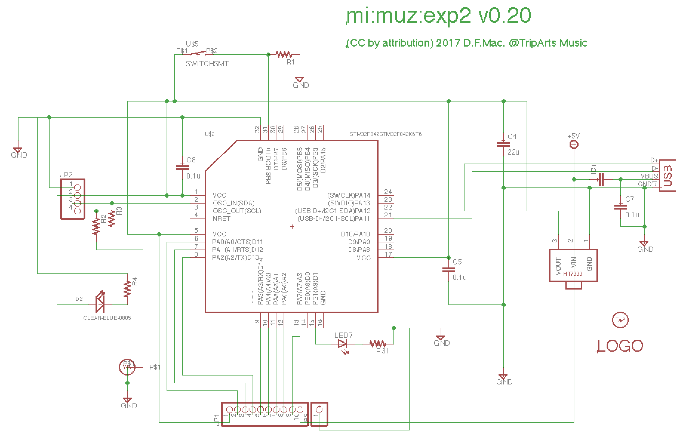
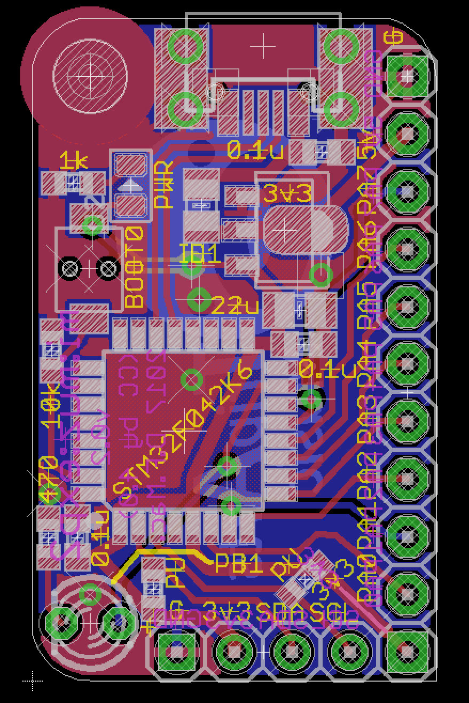

# mi:muz:exp2 

## overview

`mi:muz:exp2` is a next generation of mi:muz:expr Tiny MIDI experimental board series. It based on STM32F042K6.

`mi:muz:exp2` is supported easy programming operation by DFU mode, and STM32F0Cube software environment but it does not supported mbed yet.

## Version

- v0.20 (2017.07.10)

## Schematic

## Board

## Eagle Files

[eagle files (v0.20)](./eagle/v0.2.zip)

### Parts

T.B.D.

## Software

T.B.D.

### VID/PID

Currently, USB VID/PID pair in this repo are dummy.

I am planning to apply for a reservation for the PID which is temporarily set to pidcode, but they have not yet been approved yet.

Even if the PID of this Repository is accepted from [pid.codes](http://pid.codes/), these are impossible to use in another product.

## Licenses

- [Licences for mi:muz:exp2](./LICENSE.md)

